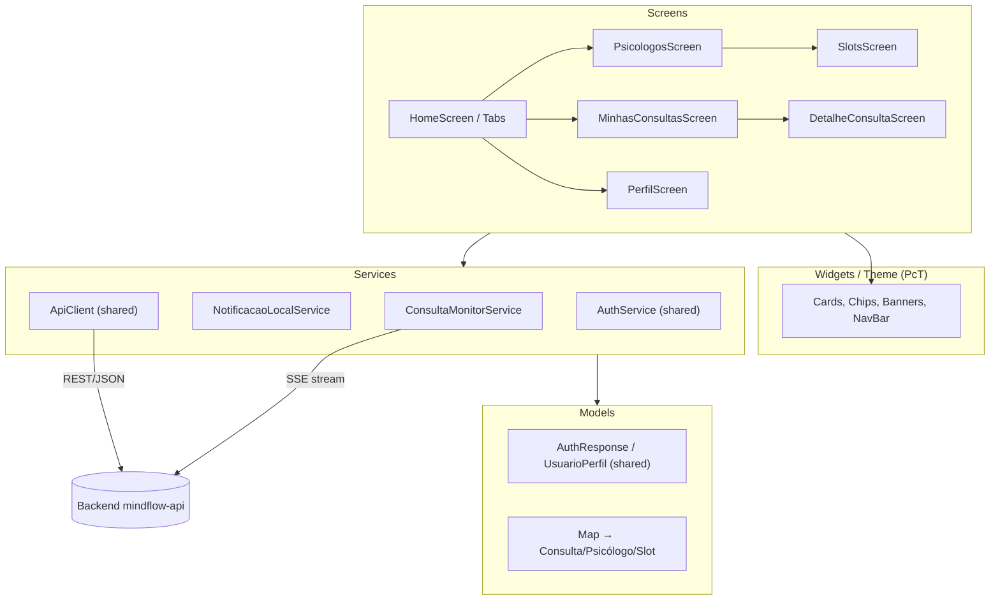

# Arquitetura em Camadas do App Paciente (mindflow_paciente)

> Documentação da arquitetura do app paciente — diagrama de camadas (models, services,
> widgets, screens) e justificativas de design, referente à entrega "Arquitetura do app
> documentada" da Sprint 3.

## 1. Visão geral

O app paciente segue uma adaptação do Clean Architecture para Flutter, organizada em
camadas que se comunicam **sempre de fora para dentro** (a UI depende dos serviços, os
serviços dependem do cliente HTTP — nunca o contrário). Parte da camada de serviços e
modelos é **compartilhada** com o app psicólogo através do pacote local `mindflow_shared`,
o que evita duplicação de código de autenticação, HTTP e tema base.

```
┌─────────────────────────────────────────────────────────────┐
│                         SCREENS                              │
│   (telas — orquestram estado da página e chamam services)    │
│   splash, login, register, home (+ tabs), psicologos,        │
│   slots, minhas_consultas, detalhe_consulta, perfil          │
└───────────────────────────┬───────────────────────────────────┘
                            │ usa
┌───────────────────────────▼───────────────────────────────────┐
│                         WIDGETS / THEME                       │
│   (componentes visuais reutilizáveis e identidade do app)     │
│   PcT (paciente_theme.dart): cores, ThemeData, helpers de     │
│   card/chip/status; widgets internos das telas (_QuickCard,   │
│   _PsicologoCard, _WellnessBanner, _NavBar etc.)              │
└───────────────────────────┬───────────────────────────────────┘
                            │ estilizado por / renderiza dados de
┌───────────────────────────▼───────────────────────────────────┐
│                         SERVICES                              │
│   (regras de aplicação, integração e estado compartilhado)    │
│   • ConsultaMonitorService — monitora consultas via SSE       │
│     (tempo real) com fallback de polling 30s + reconexão      │
│     com backoff exponencial; notifica listeners das telas     │
│   • NotificacaoLocalService — exibe notificações locais       │
│     (flutter_local_notifications) e pede permissão runtime    │
│   • [mindflow_shared] ApiClient — cliente HTTP central        │
│     (injeta JWT, trata baseUrl, métodos get/post/put/patch)   │
│   • [mindflow_shared] AuthService — login, registro, logout,  │
│     persistência de sessão                                    │
│   • [mindflow_shared] NotificationService — abstração comum   │
│     de notificação usada por ambos os apps                    │
└───────────────────────────┬───────────────────────────────────┘
                            │ consome / popula
┌───────────────────────────▼───────────────────────────────────┐
│                          MODELS                               │
│   (estruturas de dados trocadas com o backend)                │
│   • [mindflow_shared] AuthResponse, UsuarioPerfil             │
│   • Mapas tipados (Map<String, dynamic> via jsonDecode) para  │
│     Consulta, Psicólogo, Slot — ver justificativa no item 4   │
└───────────────────────────┬───────────────────────────────────┘
                            │ HTTP/JSON (REST) + SSE (stream)
                  ┌─────────▼─────────┐
                  │   Backend REST     │
                  │ (mindflow-api –    │
                  │  Spring Boot)      │
                  └────────────────────┘
```

## 2. Mapeamento camada → arquivos

| Camada | Arquivos | Responsabilidade |
|---|---|---|
| **Screens** | `screens/splash_screen.dart`, `login_screen.dart`, `register_screen.dart`, `home_screen.dart`, `psicologos_screen.dart`, `slots_screen.dart`, `minhas_consultas_screen.dart`, `detalhe_consulta_screen.dart`, `perfil_screen.dart` | Orquestram o ciclo de vida da página (`initState`, `setState`), chamam os services, tratam loading/erro e navegação (`Navigator`) |
| **Widgets / Theme** | `theme/paciente_theme.dart` (classe `PcT`) + widgets privados dentro das próprias telas (`_DashboardTab`, `_QuickCard`, `_PsicologoCard`, `_WellnessBanner`, `_NavBar`, `_ErroView`, `_VazioView`...) | Definem a identidade visual (paleta teal/wellness `#0D9488`), `ThemeData`, e componentes de UI reaproveitáveis (cards, chips de status, banners) |
| **Services** | `services/consulta_monitor_service.dart`, `services/notificacao_local_service.dart` + `mindflow_shared/services/api_client.dart`, `auth_service.dart`, `notification_service.dart` | Integração com backend (REST + SSE), regras de atualização assíncrona de estado, autenticação/sessão, notificações locais |
| **Models** | `mindflow_shared/models/auth_response.dart`, `usuario_perfil.dart` (+ `Map<String, dynamic>` decodificados ad-hoc nas telas para Consulta/Psicólogo/Slot) | Tipagem dos dados trocados com a API |

## 3. Fluxo de dados — exemplo prático (agendar consulta)

```
PsicologosScreen
   │  toque em "Ver horários"
   ▼
SlotsScreen ── ApiClient.get('/disponibilidades/{id}/slots?data=...')
   │                                  (REST síncrono — listar opções)
   │  toque no horário
   ▼
SlotsScreen ── ApiClient.post('/consultas', {...})
   │                                  (REST síncrono — cria a solicitação)
   ▼
Backend salva + publica evento "consulta.solicitada" no RabbitMQ
   ▼
ConsultaMonitorService (SSE em /notificacoes/stream, com fallback de
polling a cada 30s) recebe a atualização de status em tempo real
   ▼
MinhasConsultasScreen / DetalheConsultaScreen são notificadas via
listener (`adicionarListener`) e atualizam a tela automaticamente
— sem ação manual do usuário (atende ao requisito de "atualização
assíncrona de estado" da Sprint 3)
```

## 4. Decisões de arquitetura

- **Por que separar assim:** a tela (Screen) nunca fala diretamente com `http`/SSE — ela
  delega ao `ApiClient` (via `ConsultaMonitorService` ou chamada direta) e ao
  `AuthService`. Isso é o que viabiliza testar a lógica de integração isolada da UI e troca
  de fonte de dados sem reescrever telas (princípio de Clean Architecture / SOLID —
  Dependency Inversion).
- **Atualização assíncrona dupla:** o app combina dois mecanismos — SSE (push em tempo
  real, preferencial) e polling de 30s como rede de segurança caso a conexão SSE caia —
  com reconexão por backoff exponencial (5s, 10s, 20s, 40s, 80s). Em Flutter Web, a
  camada SSE é desativada (`if (!kIsWeb) _conectarSSE()`) por limitação do navegador em
  expor streams HTTP de forma incremental via `http.Client`; o app cai automaticamente
  para o polling, sem qualquer alteração de comportamento percebida pelo usuário.
- **Compartilhamento entre apps:** `mindflow_shared` funciona como uma camada
  transversal (cross-cutting) usada tanto pelo app paciente quanto pelo psicólogo,
  evitando duplicação de autenticação, cliente HTTP e modelos comuns.
- **Limitação conhecida e direção futura:** os dados de Consulta/Psicólogo/Slot
  trafegam hoje como `Map<String, dynamic>` decodificados diretamente nas telas, em vez
  de classes de modelo tipadas (`Consulta.fromJson`, `Psicologo.fromJson`). Essa é uma
  simplificação deliberada para o escopo atual do projeto — funcional e suficiente para
  os fluxos implementados — mas a migração para modelos tipados é o próximo passo natural
  de evolução da camada de Models, caso o projeto continue além do escopo acadêmico.

## 5. Diagrama (Mermaid)


